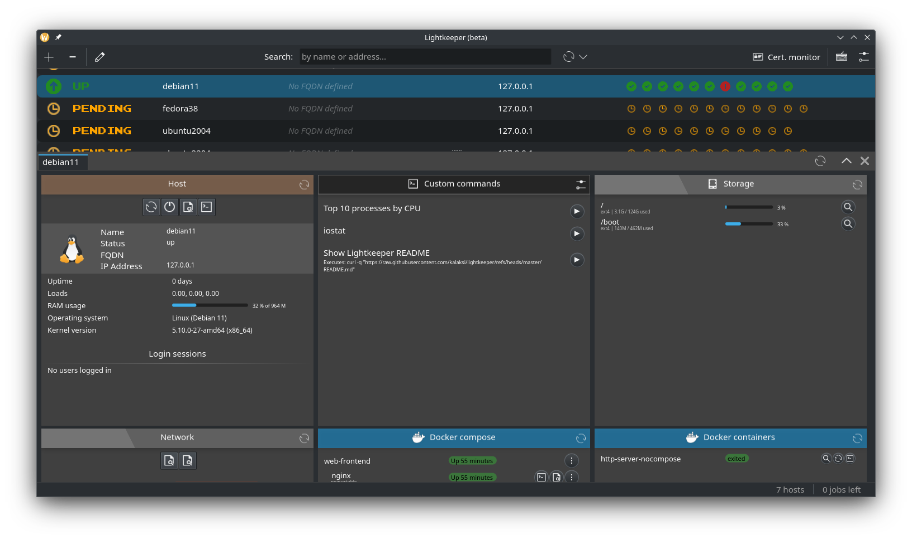
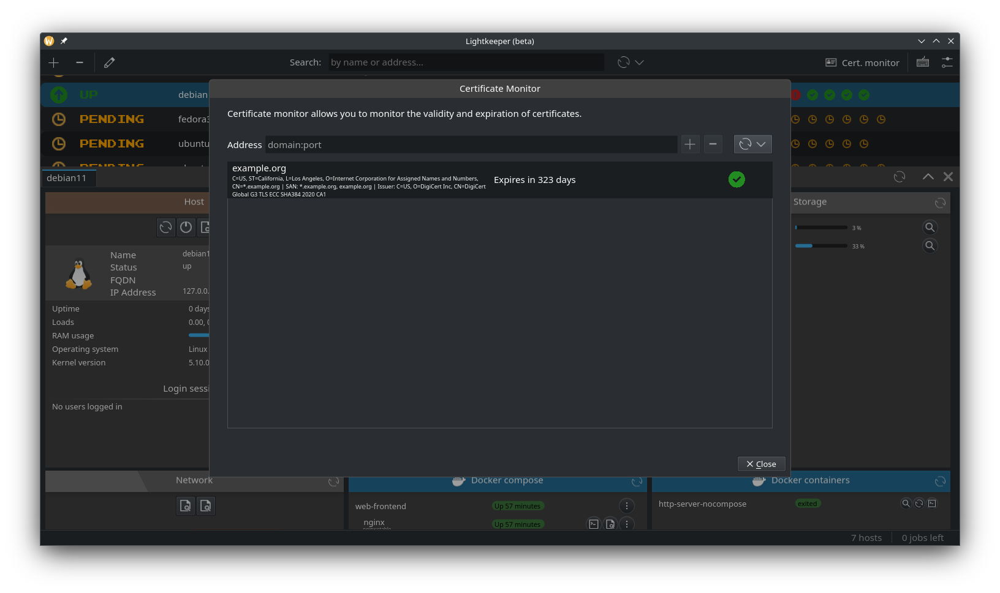
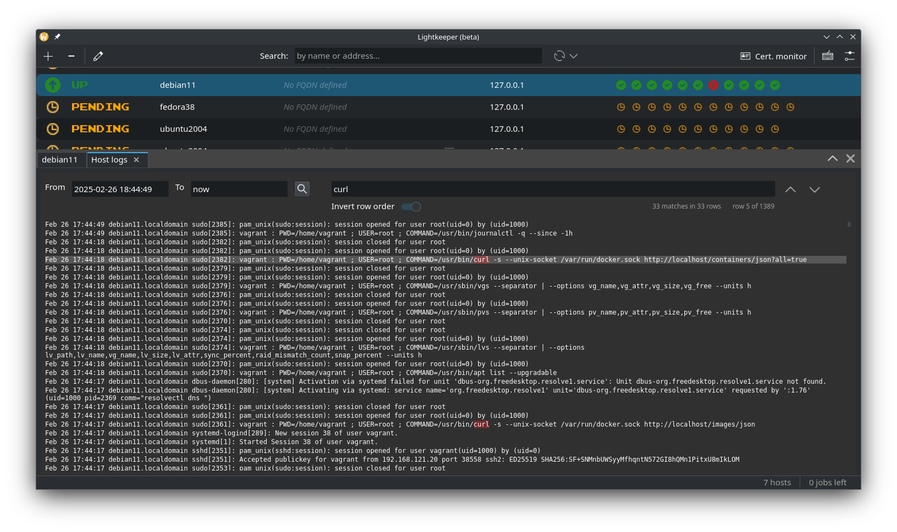
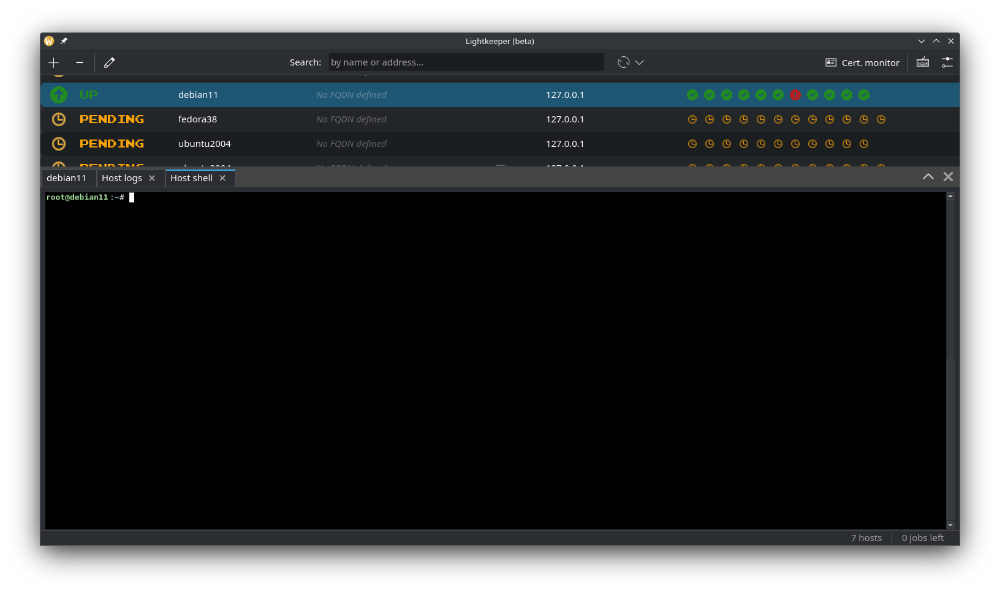

# LightkeeperRM

**LightkeeperRM (Remote Management) is a customizable server management tool for maintaining servers over SSH.**
Lightkeeper provides efficient view over server's resources and reduces repetitive typing.
It simplifies general maintenance tasks such as upgrades, monitoring, debugging and configuration.
  
**Agentless monitoring of hosts and certificates.**  
No additional daemons, agents or other software is needed on target hosts. LightkeeperRM will only run standard Linux commands already available on the host.
You can see executed commands through debug log and on target hosts's logs (depending on setup), so it's easy to audit and debug.

**Extensive keyboard shortcuts**.  
Lightkeeper uses hotkeys extensively and gets out of the way in case you need to use terminal.  
Just press Ctrl-T to open a terminal in a new tab.
  
**LightkeeperRM is customizable**, modular and easily extendable, so that it can be modified for different needs.  
  
  
*NOTE: Lightkeeper is currently in beta and is missing some features. Documentation is also not yet complete.*

<br />
<br />
<p align="center">
    
    <i>Overview of LightkeeperRM's GUI.</i>
</p>
<br />
<p align="center">
    
    <i>Certificate monitoring tool.</i>
</p>
<br />
<p align="center">
    
    <i>Integrated log viewer.</i>
</p>
<br />
<p align="center">
    
    <i>Integrated terminal.</i>
</p>
<br />

## Some features
- Monitor status changes periodically and get alert notifications.
- Monitor certificate validity and expiration.
- Status summary in host table for quick status view.
- Charts for visualizing historical values (not yet complete!).
- Log viewer with regex search and hotkeys similar to less/vim.
- Text file editor for editing remote files (with built-in editor or using CLI over SSH).
- Follow console output for longer running commands such as container builds and package updates.

## Some background
The idea for Lightkeeper rose from personal needs. Writing the same commands over the years can get tiresome and feel slow, even if utilizing shell's command history.  
Another pain point was monitoring. Configuring and maintaining a software stack for relatively simple monitoring needs (graphs, alerts) can get needlessly heavy. Specifically, in my case, I aim to replace CollectD, InfluxDB and Grafana (although, an external DB would still be possible with Lightkeeper).  
  
So, I started formulating an idea about a more integrated maintenance tool for power users to simplify everything. At the same time, deploying should be as simple as possible since the aim is to streamline. The plain old shell doesn't need additional daemons on the servers so Lightkeeper shouldn't either.  

# Table of contents

- [Installing](#installing)
   - [Flatpak](#flatpak)
- [Building from source](#building-from-source)
   - [Flatpak](#flatpak-1)
   - [Regular](#regular)
      - [Post-install](#post-install)
- [Server OS support](#server-os-support)
- [Configuration](#configuration)
   - [Configuration files](#configuration-files)
- [Debug logging](#debug-logging)
- [Testing](#testing)
- [License](#license)
   - [Lightkeeper](#lightkeeper)
   - [Crate dependencies](#crate-dependencies)
   - [Liboping](#liboping)


# Installing
## Flatpak
It is recommended to download the app from Flathub: https://flathub.org/apps/io.github.kalaksi.Lightkeeper  
It's sandboxed and uses the minimum amount of permissions required.

The alternative is building from source.

# Building from source
## Flatpak
```
# If you're missing the runtime and rust extension:
flatpak install --user runtime/org.kde.Sdk/x86_64/6.10
flatpak install --user org.kde.Platform/x86_64/6.10
flatpak install --user runtime/org.freedesktop.Sdk.Extension.rust-stable/x86_64/25.08

# Test building: 
flatpak-builder build --user --force-clean flatpak/io.github.kalaksi.Lightkeeper-local.yml

# If you want to install also:
flatpak-builder --user --install --force-clean build flatpak/io.github.kalaksi.Lightkeeper-local.yml
```

## Regular
Dependencies are:
- Qt 6.10
- liboping
- libdbus

you'll need these packages on Ubuntu 24.04:
- libssl-dev
- libdbus-1-3, libdbus-1-dev
- liboping0, liboping-dev
- libqt6svg6
- qt6-declarative-dev
- qt6-qt5compat-devel
- qml6-module-qt-labs-qmlmodels
- qml6-module-qt5compat-graphicaleffects
- qml6-module-qtqml-workerscript
- qml6-module-qtquick-controls
- qml6-module-qtquick-layouts
- qml6-module-qtquick-nativestyle
- qml6-module-qtquick-shapes
- qml6-module-qtquick-templates
- qml6-module-qtquick-window
- qml6-module-qtquick-dialogs
- qml6-module-qt-labs-platform
- qml6-module-qtcharts
- qml-module-org-kde-syntaxhighlighting

Building:
```
./build.sh
```

Running:
```
./run.sh
```

If you're getting error about missing qmake, you'll have to point cargo to correct qmake with .cargo/config.toml:
```
[env]
QMAKE = "/usr/lib/qt6/bin/qmake"
```

### Post-install

If you're using the ping monitor (not used by default), you need to give Lightkeeper binary more networking privileges:
```
$ setcap cap_net_raw+ep $MY_BINARY
```

# Server OS support
The (current) goal is to support:
- Debian
- Ubuntu
- RHEL
- CentOS
- NixOS
- Fedora
- Alpine
- Linux in general (basic functionality for most distributions)


# Configuration
**NOTE: There is currently an assumption that your user can run sudo without password (or has root privileges) on the target host since some commands need higher privileges.**  
  
Configuration can now be done using the graphical UI, but configuring can always be done directly through configuration files, too.

## Configuration files
Example configuration files `config.example.yml`, `hosts.example.yml` and `groups.example.yml` can be found in the root of this repository.

When running without flatpak, the default configuration directory is usually `~/.config/lightkeeper`.
With flatpak, it's the usual app specific directory `~/.var/app/io.github.kalaksi.Lightkeeper/config`.
You can use a custom configuration directory with the `-c`/`--config-dir` option.

# Debug logging
Log levels are controlled with environment variable `RUST_LOG`, so use `RUST_LOG=debug`.


# Testing
`test-env`-directory contains Vagrantfiles for virtual machines and also matching configurations for testing.  
You can use `--config-dir` to load the test configuration for manual testing. For example, `./target/debug/lightkeeper --config-dir test` if building from source.  
Automatic testing (`cargo test`) is currently not usable.


# License
## Lightkeeper
Copyright © 2023 kalaksi@users.noreply.github.com.  
  
This software is licensed under GNU General Public License 3.  
Dual-licensing is possible if your organization needs something else than GPL. Get in contact.  


## Crate dependencies
All crate dependencies contain permissive licenses (mostly MIT license).  
You can check the licenses with:
```
cargo tree --format "{p} {l}" --prefix none
```

Or, to quickly see what different licenses are being used by printing only unique license strings:
```
cargo tree --format "{l}" --prefix none | sort | uniq
```

## Liboping
Liboping 1.10 (https://noping.cc/) is redistributed inside the flatpak package.
It's a separate C library dependency needed by oping-crate and is distributed under LGPL-2.1 license.
