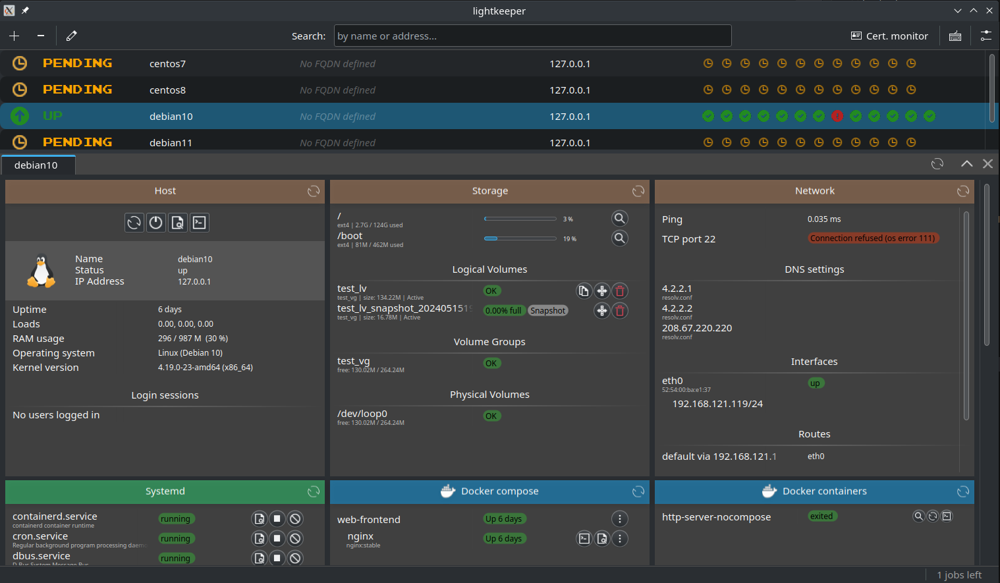

# LightkeeperRM

**LightkeeperRM (Remote Management) is a modular drop-in replacement for maintaining servers over SSH with shell commands.**
No additional daemons or other software is needed on servers. LightkeeperRM will only run standard Linux commands already available on the server.
You can see executed commands through debug log and, of course, on server's logs, so it's easy to audit and debug.  
  
**LightkeeperRM aims to be customizable**, modular and easily extendable, so that it can be modified for different needs.  
  
**User-interface is compact** and aims to keep only the most essential information visible. Clicking and navigating between different views is kept to a minimum.  
In case you find the GUI insufficient and need to dig deeper, you can always use a button for launching a terminal that logs you in through SSH.
  
*NOTE: this is currently a pre-release and still has bugs and is missing some features. Documentation is also not yet complete.*

<br />
<br />
<p align="center">
    
    <br />
    <i>Overview of LightkeeperRM's GUI.</i>
</p>
<br />


# Installing
## Flatpak
It is recommended to download the app from Flathub. The alternative is building from source.

# Building from source
## Flatpak
```
cd flatpak
flatpak-builder build --user --force-clean io.github.kalaksi.Lightkeeper.yml
# If you want to install also:
flatpak-builder --user --install --force-clean build io.github.kalaksi.Lightkeeper.yml
```

## Regular
Dependencies are:
- Qt 5.15
- liboping
- libdbus

Corresponding Ubuntu 22.04 packages are:
- qtdeclarative5-dev
- liboping0
- libdbus-1-3, libdbus-1-dev

Building:
```
cargo build
```

Running:
```
./target/debug/lightkeeper
```

### Post-install

If you're using the ping monitor, you need to give Lightkeeper binary more networking privileges:
```
$ setcap cap_net_raw+ep $MY_BINARY
```

# Configuration
Configuration is stored in configuration files and configuring is currently done directly through them. Later there will be a GUI for that.  
This repository contains example configuration files (`config.example.yml`, `hosts.example.yml` and `templates.example.yml`) in addition to ones in `test`-directory,
to use as a starting point.  

**There is also currently an assumption that your user can run sudo without password (or has root privileges) on the target host since some commands need higher privileges.**

## File locations
When running without flatpak, the default configuration directory is `~/.config/lightkeeper` and cache directory `~/.cache/lightkeeper`. It's possible the location differs if environment variables `XDG_CONFIG_HOME` and `XDG_CONFIG_CACHE` are set and point somewhere else.  
With flatpak, it's the usual app specific directory: `~/.var/app/io.github.kalaksi.Lightkeeper/config` and `~/.var/app/io.github.kalaksi.Lightkeeper/cache`.
  
You can use a custom configuration directory with the `-c`/`--config-dir` option.

# Testing
`test`-directory contains Vagrantfiles for virtual machines and also matching LightkeeperRM configurations.  
Use `--config-dir` to load the test configuration. For example, `./target/debug/lightkeeper --config-dir test` if building from source.


# License
## Lightkeeper
This software is licensed under GNU General Public License 3.

## Crate dependencies
All crate dependencies contain permissive licenses (mostly MIT license).  
You can check the licenses with:
```
cargo tree --format "{p} {l}" --prefix none
```

Or, to quickly see what different licenses are being used by printing only unique license strings:
```
cargo tree --format "{l}" --prefix none | sort | uniq
```

## Liboping
Liboping 1.10 (https://noping.cc/) is redistributed inside the flatpak package.
It's a separate C library dependency needed by oping-crate and is distributed under LGPL-2.1 license.
