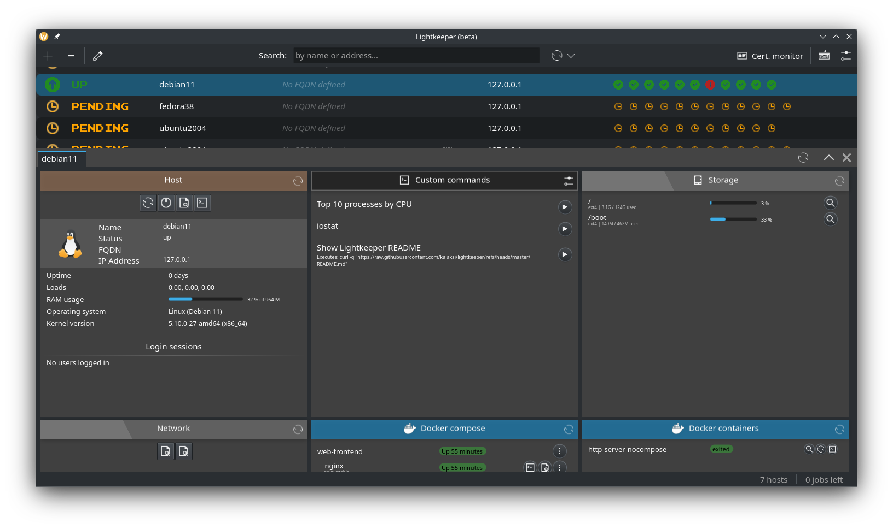
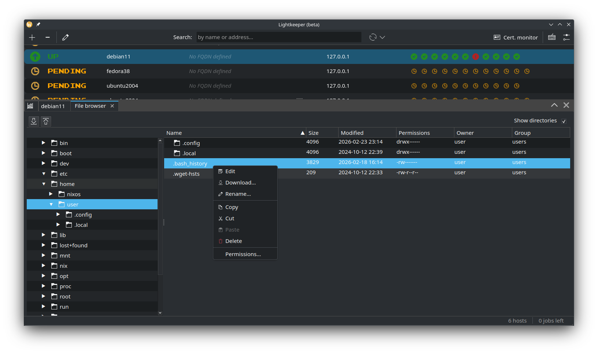
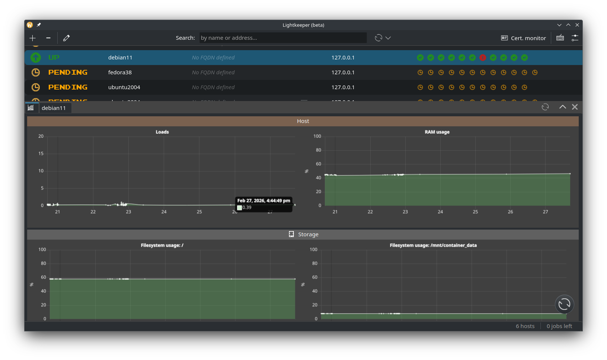
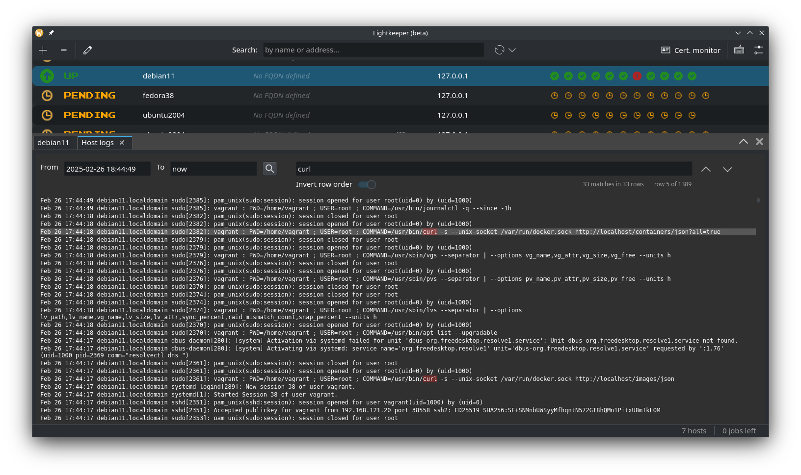
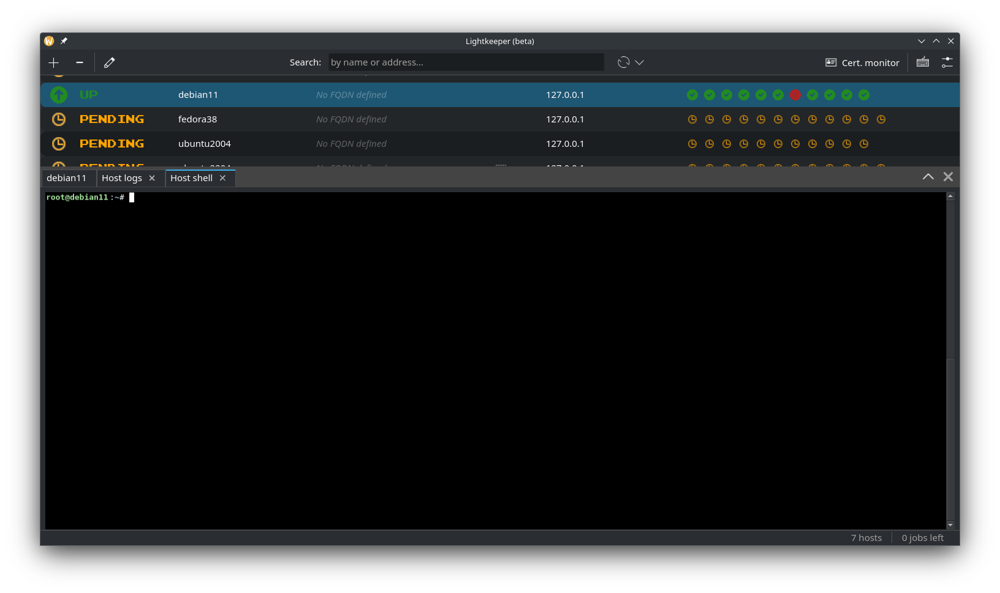
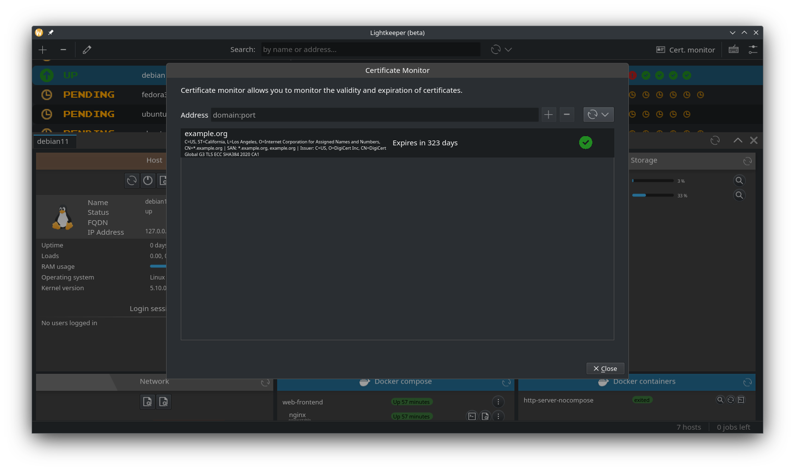

# LightkeeperRM

**LightkeeperRM (Remote Management) is a customizable server management tool for maintaining servers over SSH.**
Lightkeeper provides efficient view over server's resources and reduces repetitive typing.
It simplifies general maintenance tasks such as upgrades, monitoring, debugging and configuration.
  
**Agentless monitoring of hosts and certificates.**  
No additional daemons, agents or other software is needed on target hosts. LightkeeperRM will only run standard Linux commands already available on the host.
You can see executed commands through debug log and on target hosts's logs (depending on setup), so it's easy to audit and debug.

**Extensive keyboard shortcuts**.  
Lightkeeper uses hotkeys extensively and gets out of the way in case you need to use terminal.  
Just press Ctrl-T to open a terminal in a new tab.
  
**LightkeeperRM is customizable**, modular and easily extendable, so that it can be modified for different needs.  
  
  
*NOTE: Lightkeeper is currently in beta and is missing some features. Documentation is also not yet complete.*

<br />
<br />
<p align="center">
    
    <i>Overview of LightkeeperRM's GUI</i>
</p>
<br />
<p align="center">
    
    <i>File browser</i>
</p>
<br />
<p align="center">
    
    <i>Charts</i>
</p>
<br />
<p align="center">
    
    <i>Integrated log viewer</i>
</p>
<br />
<p align="center">
    
    <i>Integrated terminal</i>
</p>
<br />
<p align="center">
    
    <i>Certificate monitoring tool</i>
</p>
<br />

# Table of contents

- [Some features](#some-features)
- [Some background](#some-background)
- [Installing](#installing)
   - [Flatpak](#flatpak)
   - [Debian](#debian)
   - [Fedora](#fedora)
- [Building from source](#building-from-source)
    - [Dependencies](#dependencies)
    - [Building](#building)
    - [Post-install](#post-install)
- [Server OS support](#server-os-support)
- [Configuration](#configuration)
   - [Configuration files](#configuration-files)
- [Debug logging](#debug-logging)
- [Testing](#testing)
- [License](#license)
   - [Lightkeeper](#lightkeeper)
   - [Crate dependencies](#crate-dependencies)
   - [Liboping](#liboping)

## Some features
- Monitor status changes periodically and get alert notifications.
- Monitor certificate validity and expiration.
- Status summary in host table for quick status view.
- Charts for visualizing historical values (not yet complete!).
- Log viewer with regex search and hotkeys similar to less/vim.
- Text file editor for editing remote files (with built-in editor or using CLI over SSH).
- Follow console output for longer running commands such as container builds and package updates.

## Some background
Writing the same commands over the years can get tiresome and feel slow, even if utilizing shell's command history.  
Another pain point is monitoring. Configuring and maintaining a software stack for relatively simple monitoring needs (graphs, alerts) can get needlessly heavy. Specifically, in my case, I aim to replace CollectD, InfluxDB and Grafana.  
  
Lightkeeper is an maintenance tool for power users to simplify everything. At the same time, deploying should be as simple as possible since the aim is to streamline. The plain old shell doesn't need additional daemons on the servers so Lightkeeper shouldn't either.  


# Installing
## Flatpak

This is the recommended install method. Uses sandboxing and minimum amount of permissions required.  
Install from Flathub: https://flathub.org/apps/io.github.kalaksi.Lightkeeper  

To build a Flatpak bundle locally, see [flatpak/README.md](flatpak/README.md).

## Debian 14

Download `.deb` packages from the [GitHub Releases](https://github.com/kalaksi/lightkeeper/releases) page.

To build `.deb` packages locally, see [packaging/debian/README.md](packaging/debian/README.md).

## Fedora 43

Download `.rpm` packages from the [GitHub Releases](https://github.com/kalaksi/lightkeeper/releases) page.

To build RPM packages locally, see [packaging/fedora/README.md](packaging/fedora/README.md).

# Building from source
## Dependencies
- Qt 6.10
- Rust **1.88** or newer (`rustc` / `cargo`; see `rust-version` in `Cargo.toml`).

Exact development package names differ by distribution. See
[packaging/debian/README.md](packaging/debian/README.md) and
[packaging/fedora/README.md](packaging/fedora/README.md) for lists used on Debian and Fedora.

QtWebEngine is not strictly required, but needed for proper integrated text editor.

## Building
Clone the repository with submodules (needed for bundled QML components and packaging scripts):

```
git clone --recurse-submodules https://github.com/kalaksi/lightkeeper.git
cd lightkeeper
```

For development, run this in repo root:
```
./build.sh
```

For running:
```
./run.sh
```

If you're getting error about missing qmake, you'll have to point cargo to correct qmake with .cargo/config.toml:
```
[env]
QMAKE = "/usr/lib/qt6/bin/qmake"
```

## Post-install

If you're using the ping monitor (not used by default), you need to give Lightkeeper binary more networking privileges:
```
$ setcap cap_net_raw+ep $MY_BINARY
```

# Server OS support
The (current) goal is to support:
- Debian
- Ubuntu
- RHEL
- CentOS
- NixOS
- Fedora
- Fedora CoreOS
- Alpine
- Linux in general (basic functionality for most distributions)


# Configuration
**NOTE: Some commands need higher privileges. Those commands assume sudo is available and requires no password input. You can disallow sudo in host settings and those commands will be skipped.**  
  
Configuration can be done using the graphical UI or by editing configuration files.

## Configuration files
Example configuration files `config.example.yml`, `hosts.example.yml` and `groups.example.yml` can be found in the root of this repository.

When running without flatpak, the default configuration directory is usually `~/.config/lightkeeper`.
With flatpak, it's the usual app specific directory `~/.var/app/io.github.kalaksi.Lightkeeper/config`.
You can use a custom configuration directory with the `-c`/`--config-dir` option.

# Debug logging
Log levels are controlled with environment variable `RUST_LOG`, so use `RUST_LOG=debug`.


# Testing

Tests are still a work-in-progress, but you can run them with:
```
cargo test
```
  
Also, `test-env`-directory contains Vagrantfiles for virtual machines and also matching configurations for testing.  
You can use `--config-dir` to load the test configuration for manual testing. For example, `./target/debug/lightkeeper --config-dir test` if building from source.  


# License
## Lightkeeper
Copyright © 2023 kalaksi@users.noreply.github.com.  
  
This software is licensed under GNU General Public License 3.  
Dual-licensing is possible if your organization needs something else than GPL. Get in contact.  


## Crate dependencies
All crate dependencies contain permissive licenses (mostly MIT license).  
You can check the licenses with:
```
cargo tree --format "{p} {l}" --prefix none
```

Or, to quickly see what different licenses are being used by printing only unique license strings:
```
cargo tree --format "{l}" --prefix none | sort | uniq
```

## Liboping
Liboping 1.10 (https://noping.cc/) is redistributed inside the flatpak package.
It's a separate C library dependency needed by oping-crate and is distributed under LGPL-2.1 license.
